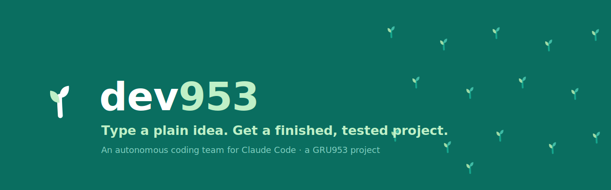

<div align="center">

<picture>
  <source media="(prefers-color-scheme: dark)" srcset="assets/logo-dark.svg">
  
</picture>

### Type a plain idea. Get a finished, tested project — shipped to your GitHub.

dev953 is a little **team of AI coders** that lives inside [Claude Code](https://claude.com/claude-code). You describe what you want in everyday words; it does the rest — thinks it through, builds it, tests that it really works, fixes what's broken, and (only when you say yes) publishes it to your own GitHub.

**You never write code. You never make a technical decision. You hear one calm voice the whole way.**


<br>



<sub>A **GRU953** project · Simple technology. For everyone. · <span lang="bn">সহজ প্রযুক্তি। সবার জন্য।</span></sub>

</div>

---

## Contents

- [What is dev953?](#what-is-dev953)
- [Quickstart](#quickstart)
- [What it does](#what-it-does)
- [Why it's different](#why-its-different)
- [How it works](#how-it-works)
- [Install](#install) — CLI · Desktop · Web · IDE
- [Use it from another AI assistant (MCP)](#use-it-from-another-ai-assistant-mcp)
- [What it promises you](#what-it-promises-you)
- [FAQ](#faq)
- [Credits & inspiration](#credits--inspiration)
- [Contributing & licence](#contributing--licence)

---

## What is dev953?

If you've ever had an idea for an app, a tool, or a little website but felt stuck because *"I can't code"* — dev953 is for you.

It's a free add-on (a **plugin**) for [Claude Code](https://claude.com/claude-code). Once it's installed, you type one line describing your idea, and dev953 runs a whole little software company on your behalf: it plans the work, writes the code, tests it, fixes mistakes, and hands you a finished result. When you're happy, it puts it on **GitHub** (a free home for code) under **your** name.

> No jargon. No setup files to edit. No "now run this command." Just your idea, in plain words.

## Quickstart

In Claude Code, run these two lines once, then describe your idea:

```
/plugin marketplace add GRU-953/dev953
/plugin install dev953@dev953
```
```
/dev953 "a tip calculator I can use from my phone"
```

That's the whole thing. It works the same on **Windows, macOS, and Linux**, and across the Claude Code CLI, desktop app, web, and IDE extensions.

## What it does

From a single sentence, dev953 walks the whole journey for you:

> **brainstorm → ideate → design → plan → build → test → fix → update → publish**

Along the way it talks to you like a knowledgeable friend who explains plainly and never makes you feel small — telling you *what* it did and *why it helps you*, never drowning you in detail. It stops only to ask a simple question or to make sure the result is what you actually wanted.

## Why it's different

Most AI coding tools hand *you* the controls and assume you know what a "repository," a "dependency," or a "merge conflict" is. dev953 is built on the opposite idea:

| Most tools | **dev953** |
|---|---|
| One AI, one attempt | A **team** of AI coders trying it **several different ways at once** |
| Keeps whatever it wrote first | Keeps only the **smallest version that genuinely passes the tests** |
| "Done" = it sounds confident | "Done" = it **actually runs**, checked by a *separate* reviewer |
| You manage the technical bits | You manage **nothing** — it asks plain questions and handles the rest |
| Leaves AI fingerprints behind | Ships clean work under **your** name, **private by default** |

The motto under the hood: **maximum agents in, minimum code out.**

## How it works

Think of it as a tiny, fast software company that spins up the moment you press enter:

1. **The lead** (the one voice you hear) understands your idea and makes a plan.
2. For each piece of work it sends out **several builders at once** — each trying a *deliberately different* approach, each in its own private sandbox so they can't trip over each other.
3. A **reviewer** and a **tester** score every attempt on one honest question: *does it run, and do the tests pass?*
4. The **smallest correct** version wins; the others are discarded.
5. A **minimalist** trims any leftover fat, and the round repeats until it stops getting better.
6. When everything's green and **you've confirmed it's what you wanted**, the **publisher** ships it to your GitHub — clean, private, and yours.

Everything runs locally through Claude Code on plain **Node.js** — no extra account, no database, no external service, the same on every operating system.

---

## Install

dev953 installs the **same way everywhere** — the two lines from [Quickstart](#quickstart), typed once into Claude Code. Here's where to type them per platform.

#### 💻 Command line (CLI)
Run `claude`, paste the two commands, quit (`Ctrl-C` twice) and restart so it loads, then `/dev953 "your idea"`. *(Trying it out? `claude --plugin-dir /path/to/dev953` runs it with no install.)*

#### 🖥️ Claude desktop app (Mac / Windows)
Type the two commands in the message box, restart the app, then `/dev953 "your idea"`. *(There's also a one-file `.mcpb` on the [releases page](https://github.com/GRU-953/dev953/releases) for the desktop MCP companion.)*

#### 🌐 Claude on the web (claude.ai/code)
Type the two commands, refresh, then `/dev953 "your idea"`.

#### 🧩 IDE extensions (VS Code / JetBrains)
Type the two commands in the Claude Code panel, reload the window, then `/dev953 "your idea"`.

---

## How to use it

Wherever you installed it, the one line is the same:

```
/dev953 "describe what you want in plain words"
```

A few first ideas:

```
/dev953 "a simple personal website with my name and links"
/dev953 "a tool that renames messy photo files by date"
/dev953 "a countdown to a date I choose"
```

Then answer the occasional plain question. **Before anything is published, dev953 shows you what it built, tells you how to see it for yourself, and asks "is this what you wanted?" Nothing goes out without your yes.**

---

## Use it from another AI assistant (MCP)

dev953 ships a small **MCP companion** so *other* AI assistants (and Claude itself) can borrow its way of working.

**Honestly:** it shares dev953's **method** — its step-by-step plan, "keep it simple" checks, "team of coders" recipe, and safety checklists — as tools any [MCP](https://modelcontextprotocol.io)-capable assistant can call. It does **not** run the full builder team for you (that needs Claude Code). Think of it as dev953's *playbook on tap*, anywhere.

- **In Claude Code** — nothing to do: it's bundled with the plugin and turns on automatically.
- **In Claude Desktop** — install the one-file **`dev953.mcpb`** from the [releases page](https://github.com/GRU-953/dev953/releases) (double-click to add it).
- **In another MCP-capable assistant** — point it at this local stdio command:
  ```
  node /path/to/dev953/mcp/server.mjs
  ```

It offers five tools — `dev953_lifecycle_plan`, `dev953_swarm_recipe`, `dev953_yagni_check`, `dev953_discipline_review`, `dev953_publish_checklist` — needs no API keys, and runs entirely on your machine.

---

## What it promises you

- 🧑‍🌾 **You own everything.** Published work goes to *your* GitHub, with *you* as the only author — no trace of AI left behind.
- 🔒 **Private by default.** Every project starts private. It only becomes public if you explicitly ask.
- 💸 **No surprises with money.** Running several AI coders at once can cost money; dev953 tells you in one line *before* a costly step and never spends past a limit you can see and change. GitHub itself is free.
- ✅ **It won't pretend.** "Done" means it genuinely runs and its tests pass — verified by a separate reviewer. If it gets truly stuck, it tells you plainly what works, what's blocking it, and your options.
- ♿ **Accessible & safe by default.** Secrets are never printed or committed and a scan runs before any push; the safety checks run on every helper, on every OS.

---

## FAQ

<details>
<summary><b>Do I need to know how to code?</b></summary>
<br>
No. If you can describe what you want in a sentence, you can use dev953.
</details>

<details>
<summary><b>Is it free?</b></summary>
<br>
The plugin and GitHub are free. The one thing that can cost money is running the AI itself (through your Claude Code usage), and dev953 always warns you in plain language before a step that could add up — and lets you set a limit.
</details>

<details>
<summary><b>Will my projects be public?</b></summary>
<br>
No — everything is created <b>private</b>, visible only to you, unless you specifically say "make it public."
</details>

<details>
<summary><b>What can it build?</b></summary>
<br>
Small, self-contained things work best to start: simple websites, command-line tools, little utilities. If something isn't a good fit, dev953 tells you plainly rather than hand you something broken.
</details>

---

## Credits & inspiration

dev953 stands on the shoulders of a generous open-source community. It studied the projects below **for ideas only** — every capability was **re-implemented originally and minimally**, and **no code was copied**. All trademarks and licences belong to their respective authors.

<details>
<summary><b>The ideas dev953 learned from</b> (click to expand)</summary>

<br>

- **Minimalism & token discipline** — *ponytail*, *caveman*, *headroom*.
- **Methodology & gates** — [Superpowers](https://github.com/obra/superpowers), *gstack*, *GSD*.
- **Memory & coordination** — [Mem0](https://github.com/mem0ai/mem0), [Graphiti / Zep](https://github.com/getzep/graphiti), [Letta / MemGPT](https://github.com/letta-ai/letta), *agentmemory*, *Graphify*, Manus-style file planning.
- **Agent harnesses** — [Aider](https://github.com/Aider-AI/aider), [OpenHands](https://github.com/All-Hands-AI/OpenHands), [Cline](https://github.com/cline/cline), [SWE-agent](https://github.com/SWE-agent/SWE-agent), [Goose](https://github.com/block/goose), [Continue](https://github.com/continuedev/continue).
- **Review, testing & quality** — [code-review (official)](https://github.com/anthropics/claude-code), [Serena](https://github.com/oraios/serena), [promptfoo](https://github.com/promptfoo/promptfoo), "one builds, another validates" (*ralph*).
- **Multi-agent orchestration** — [claude-flow](https://github.com/ruvnet/claude-flow), *oh-my-claudecode*, *competing-subagents*, worktree orchestrators.
- **Planning & observability** — *goalify*, *temporal-core*, AutoResearch-style ratchets, *claude-token-lens*.

Built as a plugin for **[Claude Code](https://claude.com/claude-code)** by Anthropic, on the **[Model Context Protocol](https://modelcontextprotocol.io)**.

</details>

---

## Contributing & licence

dev953 is open, like everything **[GRU953](https://github.com/GRU-953)** builds — improve it the way we build everything: openly, together. See **[CONTRIBUTING](CONTRIBUTING.md)**, the **[Code of Conduct](CODE_OF_CONDUCT.md)**, **[security policy](SECURITY.md)**, and the **[changelog](CHANGELOG.md)**.

Licensed under **[Apache-2.0](LICENSE)** — free to use, modify, and share, with an explicit patent grant. © 2026 GRU953.

<div align="center"><br>

<br><sub><b>dev953</b> — maximum agents in, minimum code out. · A GRU953 project.</sub>
</div>
